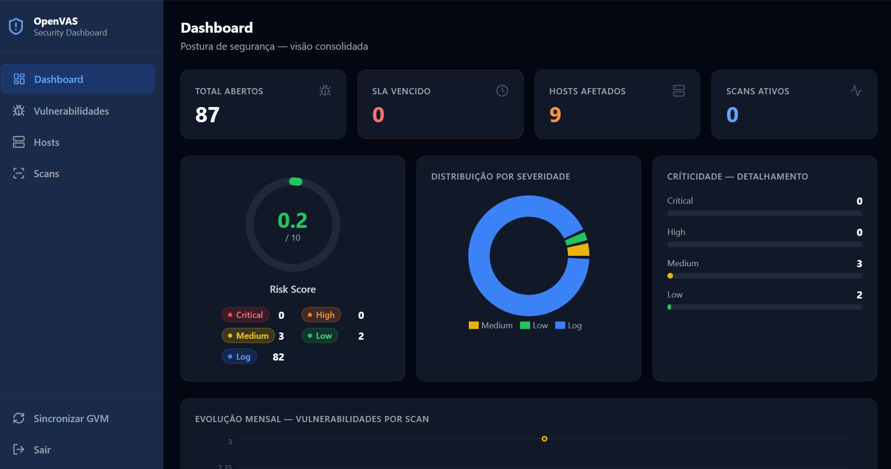

# OpenVAS Dashboard

Dashboard moderno para gestão de vulnerabilidades OpenVAS/GVM — inspirado em Nessus, Qualys e Rapid7.

## Preview



> Visão consolidada da postura de vulnerabilidades, com indicadores de exposição, distribuição por severidade, hosts afetados, scans ativos e evolução mensal.

## Stack

| Camada    | Tecnologia                                      |
|-----------|-------------------------------------------------|
| Backend   | Python 3.11 · FastAPI · python-gvm · SQLite     |
| Frontend  | React 18 · TypeScript · Tailwind CSS · Recharts |
| Protocolo | GMP via socket Unix (local) ou TLS (remoto)     |
| Deploy    | systemd + nginx (bare metal)                    |

## Funcionalidades

- **Dashboard** — Risk score, distribuição por severidade, evolução mensal, top hosts
- **Vulnerabilidades** — Tabela com filtros, busca, ordenação, drawer de detalhe com CVE links
- **Hosts** — Cards com risk score visual, drill-down de vulnerabilidades por host
- **Scans** — Lista tasks do GVM, inicia/para scans remotamente
- **Sync automática** — Scheduler busca dados do GVM a cada N minutos (configurável)
- **Sessão segura** — Autenticação via cookie HttpOnly (Argon2id + JWT, sem localStorage)

## Requisitos

- Linux com systemd (Ubuntu 22.04+ / Debian 12+ / RHEL 9+)
- Python 3.11+
- Node.js 20+
- nginx
- Acesso ao servidor GVM (socket Unix local ou TCP/TLS remoto)

```bash
# Ubuntu / Debian
apt install python3.11 python3.11-venv nodejs npm nginx rsync -y

# RHEL / Rocky / AlmaLinux
dnf install python3.11 nodejs npm nginx rsync -y
```

## Instalação

```bash
# 1. Clone o repositório
git clone https://github.com/felipenicacio/openvas-dashboard.git
cd openvas-dashboard

# 2. Crie o diretório de destino e configure o .env
sudo mkdir -p /opt/openvas-dashboard
sudo cp .env.example /opt/openvas-dashboard/.env
sudo nano /opt/openvas-dashboard/.env   # preencha os valores obrigatórios

# 3. Execute o instalador como root (detecta o diretório do clone automaticamente)
sudo bash deploy/install.sh
```

O instalador:
- Cria o usuário de sistema `ovdash` (se não existir)
- Copia os arquivos do repositório para `/opt/openvas-dashboard/`
- Cria o virtualenv Python e instala dependências
- Builda o frontend React
- Registra e inicia o serviço systemd `ovdash-backend`

## Gerenciamento de Secrets

A partir da v1.2.0, `GVM_PASSWORD` e `JWT_SECRET` são gerenciados via **systemd credentials** (`LoadCredential`), não via `.env`. O modelo antigo (`.env`) ainda funciona por compatibilidade, mas gera um aviso de deprecação e será removido na v1.3.0.

### Por que sair do .env

O `.env` expõe secrets em texto claro em backups de filesystem, listagem de processos (`/proc/<pid>/environ`), histórico shell quando editado com `echo`, e ferramentas de auditoria que inspecionam variáveis de ambiente. `APP_PASSWORD_HASH` permanece no `.env` porque é um hash Argon2id irreversível — não é um secret recuperável.

### Criando os arquivos de credential

O instalador (`install.sh`) cria automaticamente o `jwt_secret` na primeira instalação usando `openssl rand`. Para o `gvm_password`, o operador deve criá-lo manualmente:

```bash
# Criar estrutura (se necessário)
sudo install -d -m 700 -o root -g root /etc/openvas-dashboard
sudo install -d -m 700 -o root -g root /etc/openvas-dashboard/credentials

# jwt_secret: gerado automaticamente pelo install.sh com openssl rand -hex 32
# IMPORTANTE: jwt_secret é o signing key dos tokens JWT — preservar sempre.
# Rotação do JWT signing key deve ser executada por procedimento administrativo
# controlado. A substituição do jwt_secret invalida todas as sessões/tokens
# assinados com a chave anterior.

# gvm_password: criar arquivo e preencher manualmente (NUNCA use echo diretamente)
sudo install -m 600 -o root -g root /dev/null /etc/openvas-dashboard/credentials/gvm_password
sudo sudoedit /etc/openvas-dashboard/credentials/gvm_password
# Alternativa: read -rs GVM_PASS && printf '%s' "$GVM_PASS" | sudo tee /etc/openvas-dashboard/credentials/gvm_password >/dev/null && unset GVM_PASS
```

Ambos os arquivos devem ter permissão `600` (apenas root lê/escreve). O systemd entrega o conteúdo via `CREDENTIALS_DIRECTORY` ao processo sem expor via ambiente.

### Como usar LoadCredential

O `install.sh` gera automaticamente um drop-in em `/etc/systemd/system/ovdash-backend.service.d/credentials.conf` com as diretivas `LoadCredential` para cada credential que já existe em `/etc/openvas-dashboard/credentials/`. Isso garante backward compatibility: se um credential ainda não existe, o serviço inicia em modo legacy (`.env`) sem falhar.

Após criar os arquivos de credential, execute `install.sh` novamente para atualizar o drop-in:

```bash
sudo bash deploy/install.sh
systemctl cat ovdash-backend | grep LoadCredential   # confirmar que aparece
```

O systemd monta os arquivos em um diretório temporário e define `CREDENTIALS_DIRECTORY` apontando para ele. A aplicação lê automaticamente via `resolve_secret()` em `config.py`.

### Migrando de .env para systemd credentials

Se você tem `JWT_SECRET` ou `GVM_PASSWORD` no `.env`, use o script de migração dedicado:

```bash
# Migra JWT_SECRET automaticamente (sem exibir no terminal).
# GVM_PASSWORD requer migração manual (pode conter caracteres especiais).
sudo bash deploy/migrate_credentials.sh

# Após migrar, re-execute o instalador para atualizar o drop-in systemd:
sudo bash deploy/install.sh

# Confirme que o serviço carrega os credentials:
systemctl cat ovdash-backend | grep LoadCredential
sudo systemctl status ovdash-backend
```

O script `migrate_credentials.sh` instrui a migração manual segura do `GVM_PASSWORD`. Após confirmar que o serviço inicia corretamente, remova os secrets do `.env`:

```bash
sudo sed -i '/^JWT_SECRET=/d' /opt/openvas-dashboard/.env
# GVM_PASSWORD: remova a linha manualmente com sudoedit
sudo systemctl restart ovdash-backend
```

### Validação pós-instalação

```bash
# Verificar permissões dos arquivos de credential
stat /etc/openvas-dashboard/credentials/jwt_secret    # deve ser 600, root:root
stat /etc/openvas-dashboard/credentials/gvm_password  # deve ser 600, root:root

# Verificar que o serviço carrega os credentials
systemctl status ovdash-backend
journalctl -u ovdash-backend -n 50  # procurar por erros de credential

# Confirmar que .env não contém secrets (após migração)
grep -E "^JWT_SECRET=|^GVM_PASSWORD=" /opt/openvas-dashboard/.env && echo "ATENÇÃO: ainda há secrets no .env" || echo "OK: secrets não estão no .env"
```

### Troubleshooting

**Erro: "Secret 'jwt_secret' não encontrado"**
O arquivo `/etc/openvas-dashboard/credentials/jwt_secret` não existe ou `CREDENTIALS_DIRECTORY` não está definido. Verifique se o serviço usa o `.service` atualizado: `systemctl cat ovdash-backend | grep LoadCredential`.

**Erro: "systemd credential 'gvm_password' não é um arquivo regular"**
O caminho é um diretório ou socket. Verifique que o arquivo existe e é um arquivo regular: `file /etc/openvas-dashboard/credentials/gvm_password`.

**Erro: "Sem permissão para ler systemd credential"**
Permissões incorretas. Corrija com: `sudo chmod 600 /etc/openvas-dashboard/credentials/gvm_password`.

**Warning: "Legacy GVM_PASSWORD environment variable is deprecated"**
O serviço está usando o valor do `.env` em vez do credential. Crie o arquivo de credential e remova a variável do `.env`.

**Erro: "systemd credential 'gvm_password' excede o limite de 4096 bytes"**
O arquivo de credential é maior que 4096 bytes. Isso não é uma senha válida — verifique o conteúdo do arquivo.

---

## Configuração (.env)

Copie `.env.example` e preencha os campos obrigatórios. `GVM_PASSWORD` e `JWT_SECRET` são gerenciados via systemd credentials (veja seção acima); os demais campos permanecem no `.env`:

```dotenv
# ── Conexão GVM ───────────────────────────────────────────────────────────────
# Perfil A — GVM local via socket Unix (recomendado):
GVM_SOCKET_PATH=/run/gvmd/gvmd.sock
GVM_USERNAME=admin
# GVM_PASSWORD: não coloque aqui — use systemd credential (veja Gerenciamento de Secrets)

# Perfil B — GVM remoto via TLS (comentar GVM_SOCKET_PATH acima):
# GVM_HOST=192.168.1.100
# GVM_PORT=9390
# GVM_USERNAME=admin

# ── Autenticação do dashboard ─────────────────────────────────────────────────
APP_USERNAME=operador           # nome de usuário para login
APP_PASSWORD_HASH=              # hash Argon2id — gere com: python backend/generate_hash.py
# (APP_PASSWORD_HASH é um hash irreversível, pode permanecer no .env)

# ── JWT ───────────────────────────────────────────────────────────────────────
# JWT_SECRET: não coloque aqui — use systemd credential (veja Gerenciamento de Secrets)
JWT_EXPIRE_MINUTES=30

# ── Cookie ────────────────────────────────────────────────────────────────────
COOKIE_SECURE=true              # false apenas em desenvolvimento HTTP local

# ── CORS ──────────────────────────────────────────────────────────────────────
# Deixar vazio quando nginx serve frontend e /api no mesmo domínio (same-origin).
# Definir apenas se frontend e API estiverem em origens distintas:
# CORS_ORIGINS=https://dashboard.sua-empresa.com

# ── Outros ────────────────────────────────────────────────────────────────────
APP_ENV=production
ENABLE_API_DOCS=false           # NUNCA true em produção
SYNC_INTERVAL_MINUTES=30
```

### Perfil A — GVM via socket Unix (recomendado)

Conceda acesso ao socket para o usuário do serviço:

```bash
sudo usermod -aG gvmd ovdash
sudo systemctl restart ovdash-backend
```

### Perfil B — GVM remoto via TLS

Edite `/etc/systemd/system/ovdash-backend.service` e adicione o IP do servidor GVM
à diretiva `IPAddressAllow` (veja comentários no arquivo). Recarregue:

```bash
sudo systemctl daemon-reload && sudo systemctl restart ovdash-backend
```

## Gerenciamento do serviço

```bash
# Status
systemctl status ovdash-backend

# Logs em tempo real
journalctl -u ovdash-backend -f

# Reiniciar (após alterar .env)
systemctl restart ovdash-backend
```

## Atualização

O script de instalação é idempotente — execute novamente após `git pull`:

```bash
cd openvas-dashboard
git pull
sudo bash deploy/install.sh
```

## Sincronização manual

Faça login no dashboard e clique em **"Sincronizar GVM"** na sidebar, ou via curl
(a sessão é gerenciada por cookie — use `-c`/`-b` para persistir):

```bash
# 1. Login (salva cookie na sessão; login é isento da verificação CSRF)
curl -s -X POST https://<servidor>/api/auth/token \
  -H "Content-Type: application/json" \
  -d '{"username":"operador","password":"sua-senha"}' \
  -c cookies.txt

# 2. Sincronização manual (inclui Origin para passar o middleware CSRF)
curl -s -X POST https://<servidor>/api/scans/sync \
  -H "Origin: https://<servidor>" \
  -b cookies.txt
```

## Desenvolvimento local

```bash
# Backend
cd backend
python -m venv .venv && source .venv/bin/activate
pip install -r requirements.txt
cp ../.env.example .env  # edite: APP_ENV=development, COOKIE_SECURE=false
APP_ENV=development DATA_DIR=./data uvicorn app.main:app --reload --port 8000

# Frontend (outro terminal)
cd frontend
npm install
npm run dev
# Acesse http://localhost:5173
```

## Estrutura do projeto

```
openvas-dashboard/
├── backend/
│   ├── app/
│   │   ├── main.py           # FastAPI + middleware + scheduler
│   │   ├── config.py         # Settings (pydantic-settings, fail-secure)
│   │   ├── csrf.py           # Middleware CSRF (Origin/Referer)
│   │   ├── auth.py           # JWT + RBAC + cookie HttpOnly
│   │   ├── security.py       # Argon2id, revogação de JTI
│   │   ├── gvm_client.py     # Wrapper GMP (python-gvm)
│   │   ├── sync.py           # Sync GVM → SQLite
│   │   ├── database.py       # SQLite cache + init
│   │   ├── models/schemas.py # Pydantic schemas
│   │   └── routers/          # auth · dashboard · vulns · hosts · scans
│   ├── tests/
│   │   └── test_security.py  # Testes de segurança (pytest)
│   └── requirements.txt
├── frontend/
│   ├── src/
│   │   ├── pages/            # Dashboard · Vulnerabilities · Hosts · Scans
│   │   ├── components/       # Layout · SeverityBadge · RiskGauge · StatCard
│   │   ├── api/client.ts     # Axios + interceptors (cookie auth)
│   │   └── types/index.ts    # TypeScript types
│   └── package.json
├── deploy/
│   ├── ovdash-backend.service  # Systemd unit (hardened)
│   ├── nginx.conf              # Configuração nginx (proxy reverso)
│   ├── install.sh              # Script de instalação
│   └── migrate_credentials.sh  # Migração de secrets do .env para systemd credentials
├── .env.example
└── README-security.md          # Detalhes de segurança e checklist de produção
```

## API

Autenticação via cookie de sessão HttpOnly (definido no login, enviado automaticamente
pelo browser). Documentação interativa disponível quando `ENABLE_API_DOCS=true`
(apenas em desenvolvimento).

| Endpoint                    | Método | Auth   | Descrição                     |
|-----------------------------|--------|--------|-------------------------------|
| `/api/auth/token`           | POST   | —      | Login (define cookie sessão)  |
| `/api/auth/logout`          | POST   | ✓      | Logout (revoga sessão)        |
| `/api/auth/me`              | GET    | ✓      | Perfil do usuário autenticado |
| `/api/dashboard/summary`    | GET    | ✓      | KPIs, trend, top hosts        |
| `/api/vulnerabilities`      | GET    | ✓      | Lista com filtros e paginação |
| `/api/vulnerabilities/{id}` | GET    | ✓      | Detalhe de uma vulnerab.      |
| `/api/hosts`                | GET    | ✓      | Lista hosts com risk score    |
| `/api/hosts/{ip}`           | GET    | ✓      | Host + vulnerabilidades       |
| `/api/scans`                | GET    | ✓      | Tasks do GVM                  |
| `/api/scans/{id}/start`     | POST   | ✓ ADMIN  | Inicia scan                   |
| `/api/scans/{id}/stop`      | POST   | ✓ ADMIN  | Para scan                     |
| `/api/scans/sync`           | POST   | ✓ ANALYST| Sincronização manual com GVM  |
| `/api/health`               | GET    | —      | Status mínimo do serviço      |

## Licença

MIT
